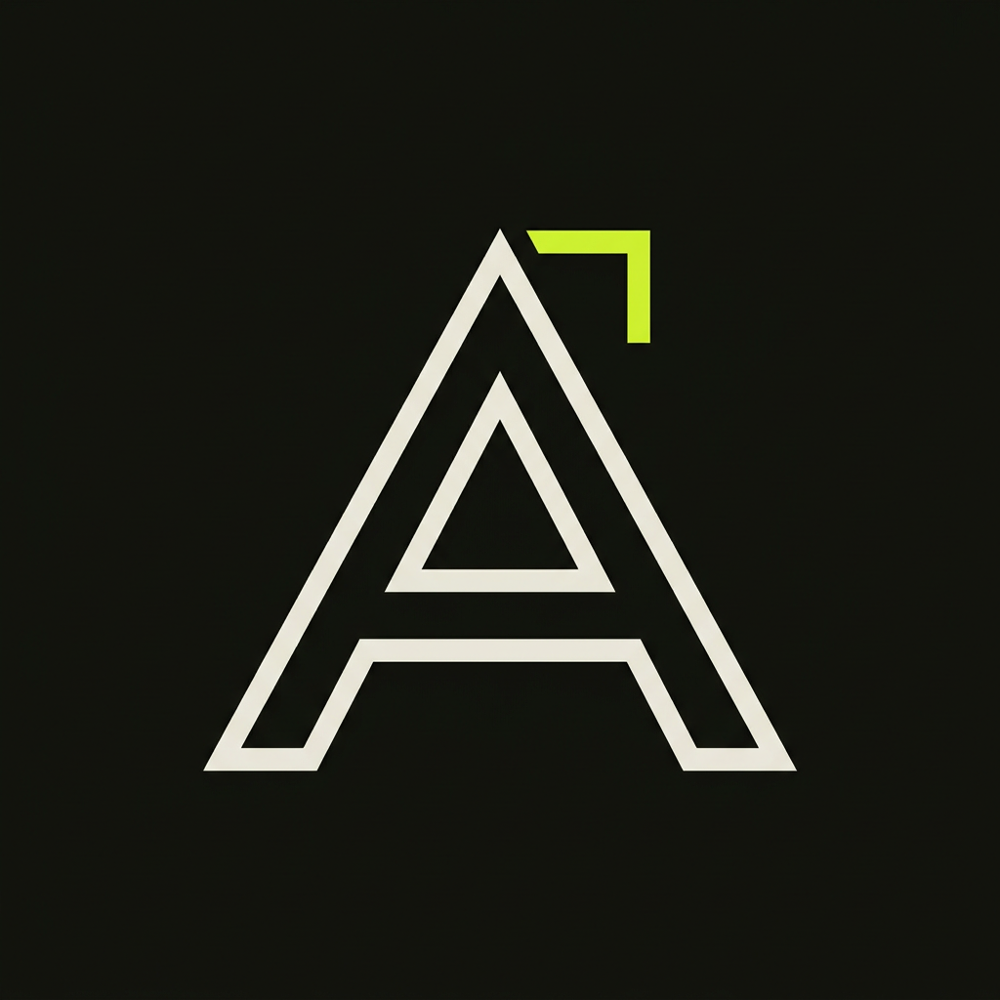
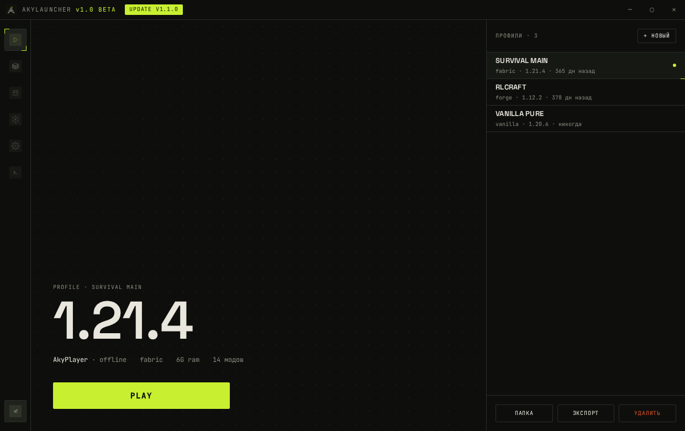
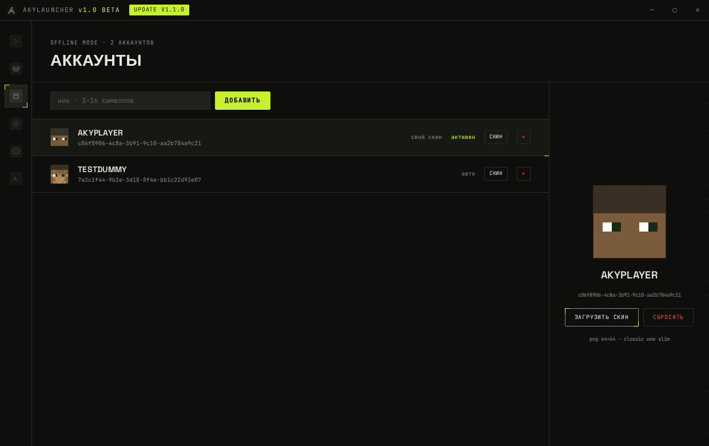
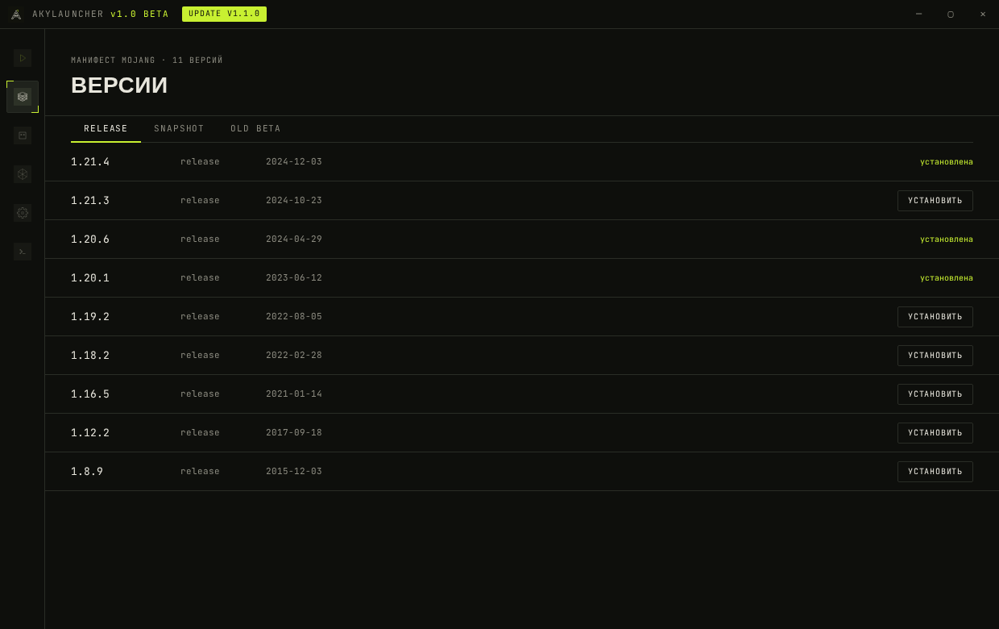
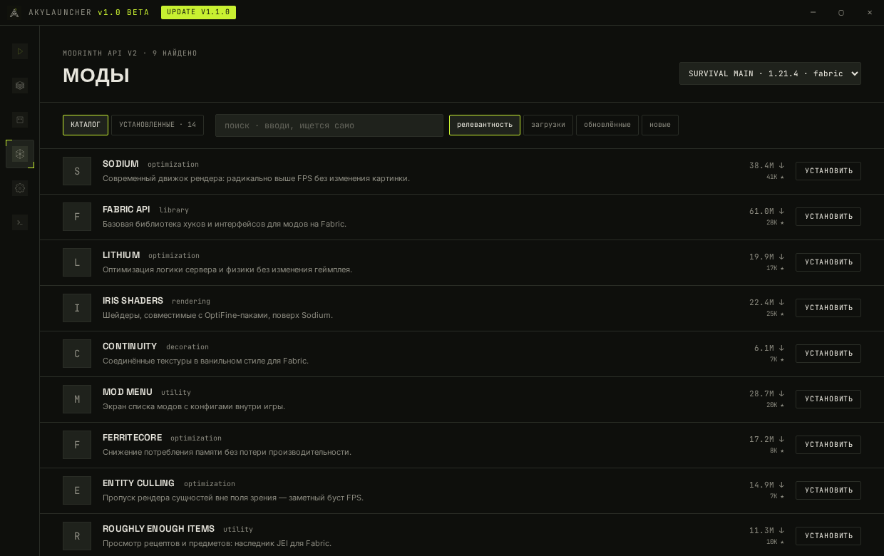
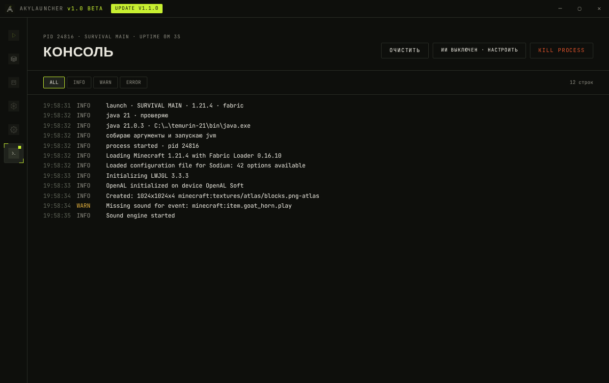

  <div align="center">



# AkyLauncher

**Minecraft-лаунчер - уникальный и красивый.**

Оффлайн-аккаунты · Fabric/Quilt в один клик · Моды с Modrinth · ИИ-диагностика крашей

[](../../releases/latest)
[](../../releases/latest)
[](#стек)
[](#разработка)
[](LICENSE)



</div>

---

## Возможности

| | |
|---|---|
| ⬛ **Оффлайн-вход** | играй под любым ником — UUID генерируется как у ванильного сервера в offline-mode |
| ⬛ **Все версии игры** | release / snapshot / old beta с официальных зеркал Mojang, sha1-проверка каждого файла |
| ⬛ **Fabric · Quilt · Forge · NeoForge** | все четыре лоадера устанавливаются автоматически при первом запуске профиля |
| ⬛ **Моды с Modrinth** | каталог с поиском, сортировкой и пагинацией; установка в один клик |
| ⬛ **Скины в игре** | загрузи PNG 64×64 в лаунчер, а через authlib-injector + ely.by скин виден прямо в игре |
| ⬛ **Экспорт профилей** | любой профиль пакуется в zip с модами и манифестом — делись сборками |
| ⬛ **Java сама** | нужный Temurin (8/17/21) скачивается и подключается без твоего участия |
| ⬛ **ИИ-диагност** | вставь бесплатный ключ [Groq](https://console.groq.com) — и лаунчер объяснит любой краш: диагноз, причина, шаги решения |
| ⬛ **Живая консоль** | стрим лога процесса, фильтры INFO/WARN/ERROR, kill process |
| ⬛ **Обновления** | лаунчер сам проверяет новые релизы на GitHub |

## Скриншоты

| Аккаунты и скины | Версии |
|---|---|
|  |  |

| Каталог модов | Консоль + ИИ-диагност |
|---|---|
|  |  |

## Установка

Скачай установщик из [последнего релиза](../../releases/latest):

- **Windows** — `AkyLauncher-Setup-1.0.0-beta.exe`
- **Linux** — `AkyLauncher-1.0.0-beta.AppImage`

Запустил → добавил ник → выбрал версию → **PLAY**. Всё остальное лаунчер сделает сам.

## Сборка из исходников

```bash
git clone https://github.com/AkyRayy/akylauncher.git
cd akylauncher/app
npm install

npm run dev          # запуск в dev-режиме
npm run dist:win     # установщик Windows
npm run dist:linux   # AppImage
```

## Стек

`Electron` + `React` + `TypeScript` · бэкенд — **Node.js** (main-process): загрузчик с пулом потоков и докачкой, типизированный IPC-контракт, zod-валидация всех конфигов и сетевых ответов, `contextIsolation: true`.


## Разработка

```bash
npm test             # 42 теста ядра: rules, classpath, uuid, merge, semver, forge, zip
npm run typecheck    # строгий tsc
npm run preview:web  # автономное веб-превью UI в ../preview/index.html
```

## Честность

AkyLauncher **не распространяет файлы игры** — всё скачивается с официальных серверов Mojang, Fabric, Adoptium и Modrinth. Оффлайн-режим лишь пропускает вход в Microsoft-аккаунт. Если игра тебе нравится — [купи её](https://www.minecraft.net).

<div align="center">
<sub>Сделано с любовью · Сделано AkyRayy</sub>
</div>
